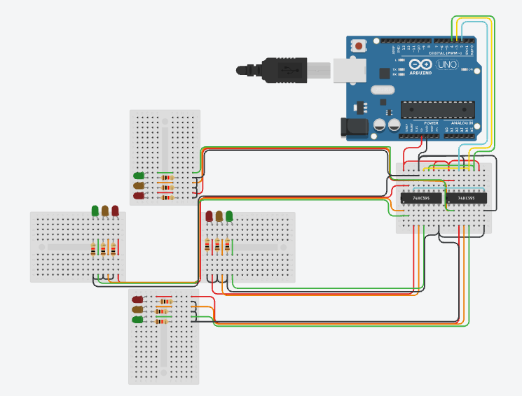

# 4-Way Traffic Light Controller using Cascaded 74HC595 Shift Registers

A synchronized 4-way intersection traffic light system built with Arduino Uno and two daisy-chained 74HC595 shift registers.

## Overview
Controlling a full 4-way traffic light intersection typically requires 12 digital output pins (3 LEDs per direction: Red, Yellow, Green). By cascading two 8-bit shift registers (74HC595) in series, this project drives all 12 LEDs independently using only **3 microcontroller pins** (Data, Clock, and Latch), drastically optimizing hardware pin utilization.

## Hardware Features
- **Microcontroller:** Arduino Uno
- **Driver ICs:** 2x 74HC595 (8-bit Serial-In / Parallel-Out Shift Registers)
- **Indicators:** 12 LEDs (4 Red, 4 Yellow, 4 Green) with current-limiting resistors
- **Daisy-Chain Interfacing:** Serial Data Out (Pin 9 / $Q_{7S}$) of the first register feeds directly into Serial Data In (Pin 14 / SER) of the second register.

## Pin Mapping & Bit Logic
Each state is transmitted as two bytes (`reg2` for East-West, `reg1` for North-South) using bitwise patterns:

| Direction | Red Bit | Orange/Yellow Bit | Green Bit |
| :--- | :---: | :---: | :---: |
| **North / South (reg1)** | Bit 0 & 3 | Bit 1 & 4 | Bit 2 & 5 |
| **East / West (reg2)** | Bit 0 & 3 | Bit 1 & 4 | Bit 2 & 5 |

### State Sequence
1. **Phase 1:** North-South Green (`B00001001`), East-West Red (`B00100100`) [5000 ms]
2. **Phase 2:** North-South Yellow (`B00010010`), East-West Red+Yellow (`B00110110`) [2000 ms]
3. **Phase 3:** North-South Red (`B00100100`), East-West Green (`B00001001`) [5000 ms]
4. **Phase 4:** North-South Red+Yellow (`B00110110`), East-West Yellow (`B00010010`) [2000 ms]

## Circuit Diagram

## How to Run
1. Open `traffic_light.ino` in the Arduino IDE.
2. Connect your hardware as outlined in the schematic.
3. Select your Arduino Uno board and COM port, then click **Upload**.
